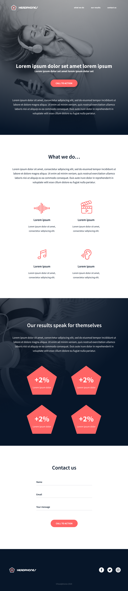
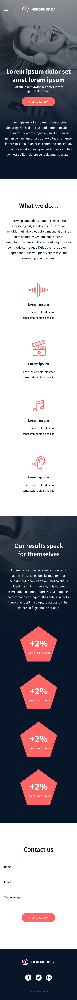

# Implement a Design From Scratch
## Headphones Company
---
### Concepts
*For this project, we expect you to look at this concept:*
* [Implement a design](https://intranet.hbtn.io/concepts/963)

---

In this project, you will implement from scratch, without any library, a web page. You will use all HTML/CSS/Accessibility/Responsive design knowledges that you learned previously.

You won’t have a lot of instruction, you are free to implement it the way that you want - the objective is simple: Have a fully functional web page that looks the same as the designer file.

---

### Final Result
#### Desktop:
  
